# VoxelSieve

Open-source tooling for industrial CT volumes, built on [OpenVDB](https://www.openvdb.org/).

Reconstructed CT volumes are large, uncompressed raw files in which most voxels are air.
VoxelSieve separates the surrounding air from the part, keeps internal voids such as pores,
and stores the result as a sparse, bricked VDB dataset that works for scans larger than memory.
On top of it, it finds pores and loosened microstructure and writes an inspection report.

| CT slice | Porosity analysis | Inspection report |
|---|---|---|
| 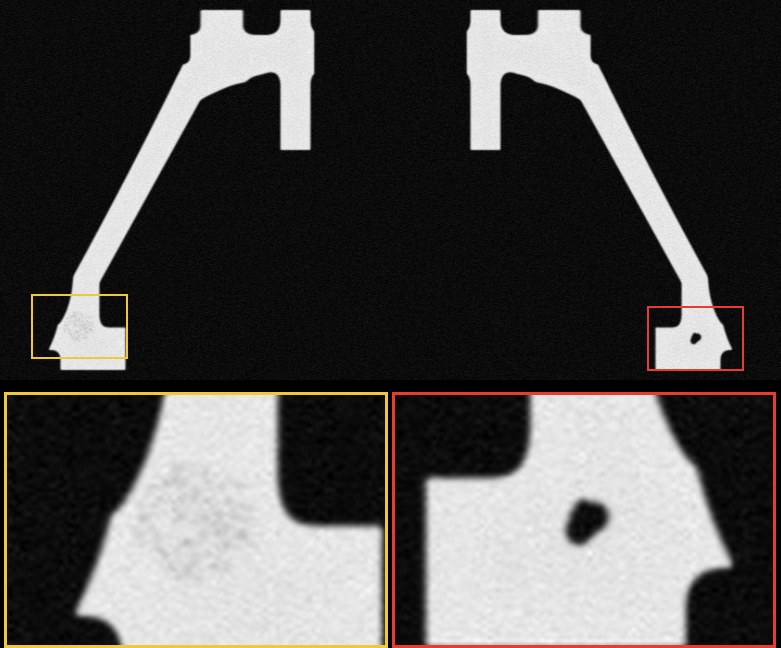 | 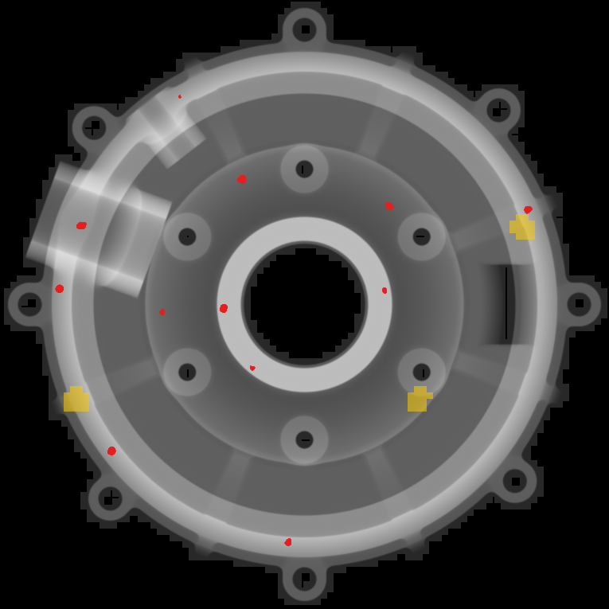 | 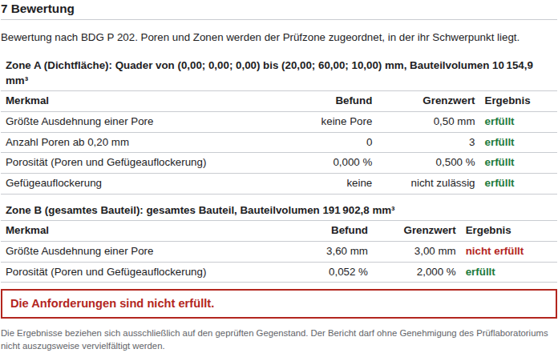 |
| Synthetic scan with noise and cupping: two loosened zones and a shrinkage cavity | `vs-porosity`: pores in red, loosened zones in yellow | `vs-report`: evaluation per inspection zone (BDG P 202 scheme) |

All three images come from one synthetic scan of 1025 × 775 × 525 voxels (830 MB), made with
`vs-synth --box 80 60 40 --voxel-size 0.08 --lunker 6 --loosening 3 --noise 500 --cupping 0.1
--seed 7`. Every lunker volume and every zone is found within 2 % of the ground truth.

Status: early development (0.1.0, see [CHANGELOG.md](CHANGELOG.md)). The tools:

| Tool | Does |
|---|---|
| `vs-sieve` | raw volume (with vendor header) or TIFF stack → sparse bricked dataset, streamed, out of core |
| `vs-porosity` | pores and loosened zones → JSON, projection images, VDB for Blender or Houdini |
| `vs-report` | porosity analysis + acceptance limits → inspection report (HTML, print to PDF) |
| `vs-synth` | STL mesh → synthetic CT scan with defects, noise and artefacts, plus ground truth |
| `vs-phantom` | simple box phantom with analytic ground truth |

## Build

On Ubuntu 24.04:

```sh
sudo apt-get install cmake ninja-build g++ libopenvdb-dev libboost-iostreams-dev \
  nlohmann-json3-dev libgtest-dev
cmake --preset release && cmake --build --preset release && ctest --preset release
./build/release/apps/vs-phantom/vs-phantom --out phantom --dims 256
```

This writes `phantom.raw` (uint16, little endian, x fastest) and `phantom.json` with the format
description and the analytic ground truth (pores, wall thickness, material volume).

## Sieve a volume

VoxelSieve writes either a bricked dataset (any size, streamed) or a single `.vdb` grid (small
volumes, in memory).

### Bricked dataset for large scans

```sh
./build/release/apps/vs-sieve/vs-sieve scan.raw --out scan.vsieve
```

`scan.vsieve/` holds `index.json`, `overview.vdb` (the whole volume in one grid of at most 256³
voxels) and `level0/`, `level1/`, … with one VDB file per 256³ brick. Bricks that contain only
outside air are not written. The input is memory-mapped and processed in two streaming passes, so
the scan does not need to fit in RAM. `--phantom N` sieves a computed N³ phantom instead of a file.

Raw files from CT systems usually start with a proprietary header. VoxelSieve skips it: given the
dimensions, everything in the file beyond the voxel data is taken as the header, and the detected
size is printed. Use `--header <bytes>` when the file also has a footer, `--type uint8` for 8-bit
data and `--big-endian` for big-endian 16-bit samples. Check the printed header size: wrong
dimensions that are too small also leave extra bytes and would be misread as a header.

| Input | Raw size | Dataset | Time | Peak memory |
|---|---|---|---|---|
| 1024³ raw file (mmap) | 2 GB | 776 MB | 6.1 s | 2.5 GB, of which ~2 GB reclaimable mapped input pages |
| 1024³ computed phantom | (2 GB) | 776 MB | 35.5 s | 0.46 GB |
| 2048³ computed phantom | (16 GB) | 5.8 GB | 345 s | 0.87 GB |

The computed phantom is slower because every voxel is evaluated twice; its memory figure shows the
sieve's own footprint without mapped input pages.

Programs read a dataset through `voxelsieve::Dataset`, which loads bricks on demand into an LRU
cache with a memory budget:

```cpp
const auto dataset = voxelsieve::Dataset::open("scan.vsieve", /*cache_bytes=*/4ULL << 30U);
std::optional<float> value = dataset.sample(0, {512, 400, 300});  // nullopt for removed air
std::vector<float> slab(512 * 512 * 16);
dataset.readRegion(0, {{0, 0, 300}, {512, 512, 316}}, slab);      // across brick boundaries
dataset.forEachBrick(1, [](const auto& brick, const openvdb::FloatGrid& grid) { /* parallel */ });
```

### TIFF stacks

```sh
./build/release/apps/vs-sieve/vs-sieve slices/ --out scan.vsieve --voxel-size 0.05
./build/release/apps/vs-sieve/vs-sieve scan.zip --out scan.vsieve        # read without extracting
./build/release/apps/vs-sieve/vs-sieve scan.zip --folder target --threshold 0.5 --out labels.vsieve
```

A directory of slices, a multi-page TIFF or a ZIP archive of either is read directly
(`voxelsieve::TiffStackSource`, ADR 0011). Slices are sorted by name with numbers by value
(`slice2` before `slice10`). Supported are classic TIFF and BigTIFF, strips and tiles,
uncompressed, LZW, Deflate and PackBits, with or without horizontal predictor, and unsigned 8 or 16
bit samples; 32-bit samples are accepted as long as they fit into 16 bits (label volumes). Float
and colour images are refused rather than quantised. When the input holds several folders of
slices, the grey values are taken, not a folder named like labels or masks (`label*`, `mask*`,
`seg*`, `gt`, `target`); the others are printed and can be chosen with `--folder`. The voxel size
comes from a centimetre resolution or an ImageJ description, otherwise 1 mm is assumed and
printed; set it with `--voxel-size`. In the studio this is the operation `import_tiff`.

### Single grid

```sh
./build/release/apps/vs-sieve/vs-sieve phantom.raw --out phantom.vdb
```

Dimensions and voxel size are read from `phantom.json`, or given with `--dims X Y Z` and
`--voxel-size MM`. The air/material threshold is estimated with Otsu's method unless `--threshold`
is set; `--margin` controls how many voxels of air stay around the part. `--dense` writes every
voxel without sieving, as a baseline. The resulting `.vdb` opens directly in Blender or Houdini.

Phantom benchmark (hollow box with pores filling about a quarter of the volume, noise σ = 500,
4 cores):

| Volume | Raw | Dense VDB | Sieved VDB | Active voxels | Sieve time |
|---|---|---|---|---|---|
| 256³ | 32 MB | 43.6 MB | 11.8 MB | 27 % | 0.03 s |
| 512³ | 256 MB | 348.9 MB | 85.9 MB | 26 % | 0.23 s |

Sieved files store grey values as 32-bit float (lossless, see ADR 0002), which is why the dense
baseline is larger than the raw file.

Design decisions are recorded in [docs/adr](docs/adr).

## Synthetic scans from STL

`vs-synth` turns a closed STL mesh (in mm) into a raw CT volume with artificial defects, noise and
artefacts, plus a JSON sidecar with the ground truth. It is the test bed for defect analyses.

```sh
./build/release/apps/vs-synth/vs-synth part.stl --out part --voxel-size 0.05 \
    --lunker 5 --loosening 2 --noise 500 --cupping 0.1 --rings 8
./build/release/apps/vs-sieve/vs-sieve part.raw --out part.vsieve
```

- `--lunker N`: shrinkage cavities, irregular unions of overlapping spheres.
- `--loosening N`: zones of loosened microstructure (Gefügeauflockerung), many small pores near or
  below the voxel size up to `--loosening-porosity` (default 5 %).
- `--noise`, `--cupping` (beam hardening), `--rings` (ring artefacts around the z axis).
- `--blur MM`: unsharpness of the imaging chain, a Gaussian point spread function with this sigma.
- `--box X Y Z` uses a box instead of an STL file; `--part housing|bracket|hub` uses a sample
  casting with walls, ribs, bosses, bores and fillets (`--scale`, `--stl` writes its mesh).

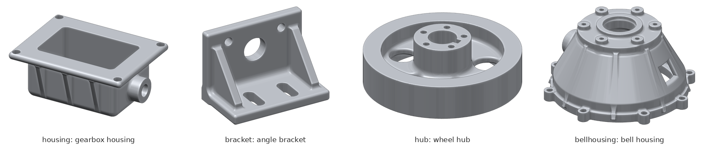

`part.json` lists every defect with its position, size and void volume, and the total porosity.
The grey values carry the void volume exactly, even for pores much smaller than a voxel (see
`docs/adr/0005-synthetic-scans-from-meshes.md`). The scan is computed on demand and streamed to
disk: 1040 × 840 × 640 voxels (1.1 GB) with 15 defects take 41 s on 4 cores.

## Surface

`vs-surface` locates the surface of the part (ISO 50 % by default) and stores it as a voxel mask
with 4 bits per voxel that encode the signed distance to the surface in steps of 1/7 voxel within
±1 voxel; everything farther is just "material" or "air". Only 8³ blocks that touch the surface
are stored, zstd-compressed per brick, so the file grows with the surface area, not with the scan:

```sh
./build/release/apps/vs-synth/vs-synth --part housing --voxel-size 0.1 --blur 0.05 --out housing
./build/release/apps/vs-sieve/vs-sieve housing.raw --out housing.vsieve
./build/release/apps/vs-surface/vs-surface housing.vsieve --out housing.vss --stl housing.stl
```

The housing above (520 × 400 × 220 voxels) gives a 156 kB file, 588 : 1 against the 16-bit raw
volume, and its triangulated surface lies 0.033 voxels (RMS) from the analytic surface.
`voxelsieve::SurfaceMask` reads codes and distances of single voxels or regions, and converts to a
VDB level set or a mesh; `--vdb` exports the level set for Blender or Houdini. The studio runs it
as the operation "Oberfläche" and shows the middle slices of the mask. Format and measurements:
`docs/adr/0009-surface-distance-mask.md`.

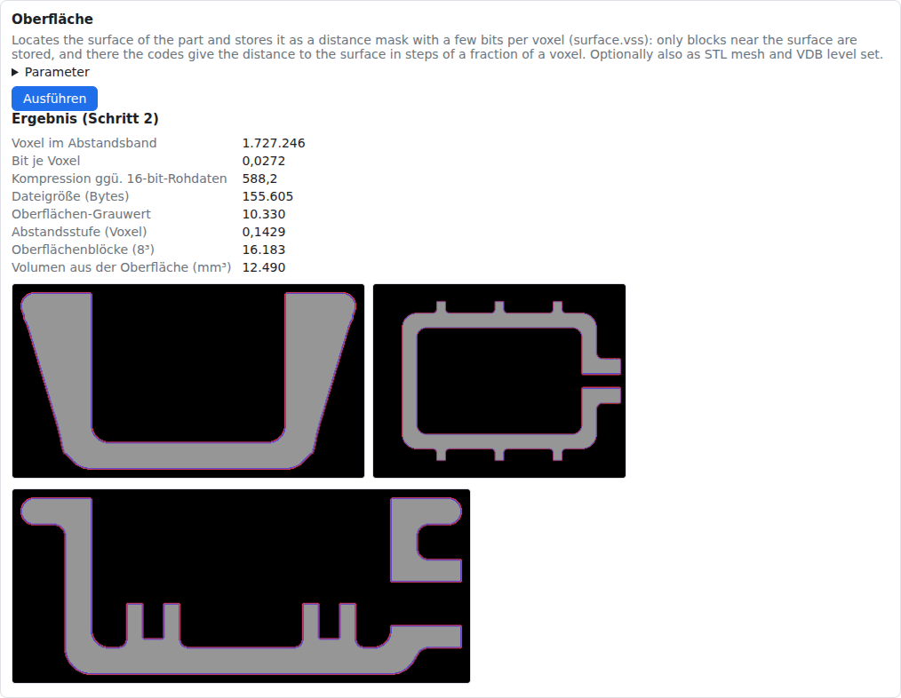

## Nominal-actual comparison

`vs-compare` compares the surface of a scan with the CAD model of the part (STL in mm). It aligns
the CAD model to the scan and measures the signed deviation of every surface point: positive where
the part has more material than nominal, negative where material is missing.

```sh
./build/release/apps/vs-compare/vs-compare housing.vss housing-cad.stl --out housing.compare \
    --tolerance 0.1
```

- **Alignment:** by default the principal axes of both surfaces give the coarse alignment, and a
  robust best fit (point-to-plane ICP) refines it. The CAD model may lie anywhere and in any
  orientation. `--align refine` starts the best fit from `--initial`, and `--align none` uses
  `--initial` as it is, for example when the CAD model is already in scan coordinates.
- **Outputs:**
  - `compare.json`: the transform, the fit, the mean, RMS, extremes and percentiles, the area in
    and out of tolerance, and a histogram.
  - `deviation.ply`: the scanned surface with the deviation and a colour per vertex.
  - `deviation_view_1.png`, `deviation_view_2.png`: shaded views from above and from below.
  - `cad_aligned.stl` with `--aligned-stl`: the CAD model moved into scan coordinates.
- **Internal voids:** surfaces of closed internal voids (pores) are left out by default; they
  belong to the porosity analysis.

On synthetic castings the fit finds the pose of the CAD model to 0.15 voxels, and it measures a
0.4 mm dent to 0.02 mm. The studio runs the comparison as the operation "Soll-Ist-Vergleich" and
shows the coloured surface in the 3D view as "Soll-Ist-Abweichung". Method and decisions:
`docs/adr/0010-nominal-actual-comparison.md`.

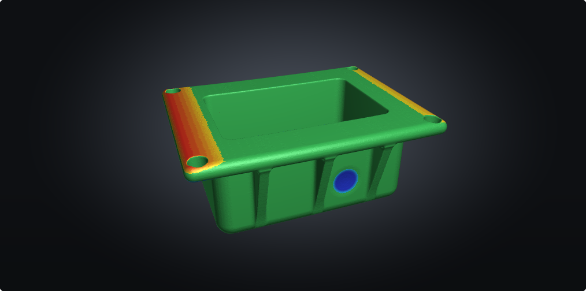

## Porosity analysis

`vs-porosity` finds internal pores and zones of loosened microstructure in a sieved dataset:

```sh
./build/release/apps/vs-porosity/vs-porosity part.vsieve --out part.porosity
```

- `porosity.json`: part volume, porosity, and every pore and zone with centre, bounds and void
  volume.
- `projection_x.png`, `projection_y.png`, `projection_z.png`: the part as a grey thickness image,
  pores in red, zones in yellow.
- `porosity.vdb`: grids `pores` and `zones` in the dataset's world space, to view next to the part
  in Blender or Houdini.

Pore volumes come from the grey values, so partially filled edge voxels count with their fraction.
Zones are 8³ blocks whose grey value lies clearly below the material level at the same depth below
the surface, so cupping from beam hardening is not reported as porosity (see
`docs/adr/0006-porosity-analysis.md`). On an 830 MB synthetic scan (1025 × 775 × 525 voxels,
6 lunkers, 3 loosened zones, noise and 10 % cupping) every lunker is within 2 % of its true volume,
every zone within 2 %, and the total porosity within 1 %; the analysis takes 14 s on 4 cores.
`PorosityOptions` and the `--min-pore`, `--zone-sigma` and `--zone-min` options set the detection
limits.

## Inspection report

`vs-report` runs the porosity analysis, evaluates it against the acceptance limits of an
inspection order and writes a test report as one self-contained HTML file (print to PDF from the
browser):

```sh
./build/release/apps/vs-report/vs-report part.vsieve --order examples/inspection_order.json \
    --out part.report
```

The report is structured after the report contents of DIN EN ISO/IEC 17025 (7.8) and the CT test
report of DIN EN ISO 15708-3: order, part, method, scan settings, analysis parameters and
detection limits, results with projection images and pore list, evaluation and approval. The
inspection order (`examples/inspection_order.json`) supplies what the scan cannot know, such as
the customer, the part number or the tube voltage; missing mandatory fields are marked
"nicht angegeben" in the report and printed as warnings.

Acceptance follows the scheme of BDG P 202: per inspection zone (a box in dataset coordinates, or
the whole part) optional limits on the largest pore extent, the number of pores above a size, the
porosity, and whether loosened microstructure is allowed. The limits come from the drawing or the
customer.

With `--surface part.vss` (from `vs-surface`) the report shows the part and its pores in 3D: the
part as glass with pores in red and loosened zones in amber, true to scale. With
`--comparison part.compare` (from `vs-compare`) it adds the nominal-actual comparison: the key
figures, the coloured deviation from above and from below, and the histogram of the deviation.
In the studio, the report step takes the latest surface and comparison of the project when there
are any. The views are rendered on the CPU (`voxelsieve/render.hpp`), so no GPU is needed.

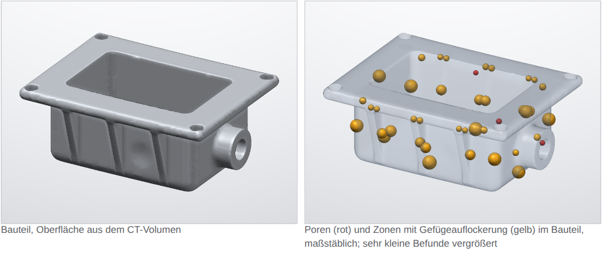

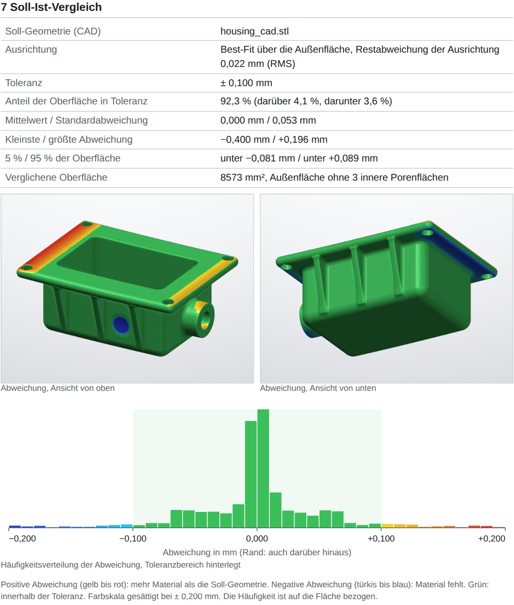

The layout is a template: `vs-report --print-template > my_template.html` prints the built-in one,
`--template my_template.html` uses your own. Templates use a Mustache subset (`{{name}}`,
`{{#list}}...{{/list}}`, `{{^name}}...{{/name}}`); `report.json` in the output shows all available
data. See `docs/adr/0007-inspection-report.md`.

## Projects, operations and plugins

The library records work as a project: a directory with `project.json` and one directory per step.
Each step stores its operation, parameters, inputs, outputs and messages; undo and redo move a
cursor over the steps, and a new step after an undo discards the undone ones. Operations never
change their inputs.

```cpp
voxelsieve::OperationRegistry registry;
voxelsieve::registerBuiltinOperations(registry);   // open_dataset, import_raw, import_tiff, porosity, …
registry.loadPlugins("plugins");                    // every *.so in the directory
auto project = voxelsieve::Project::create("casting.vsproj", "Casting 4711");
project.run(registry, "import_raw", {{"path", "scan.raw"}});
project.run(registry, "porosity");                  // input: the latest dataset
project.run(registry, "report", {{"order_path", "examples/inspection_order.json"}});
project.undo();
```

A plugin is a shared library that exports `voxelsieve_plugin_api_version()` and
`voxelsieve_register_operations()`; `examples/plugins/histogram` is a complete one. See
`docs/adr/0008-studio-projects-operations-ui.md`.

## Studio

`vs-studio` starts the studio and prints its address, by default http://localhost:8410. The browser
UI leads through three steps: choose a dataset (or import a raw file), run operations such as the
porosity analysis, create the inspection report. Every step appears in the protocol with its
parameters and results and can be undone (Ctrl+Z) and redone; the project is saved after each
step. Plugins appear next to the built-in operations.

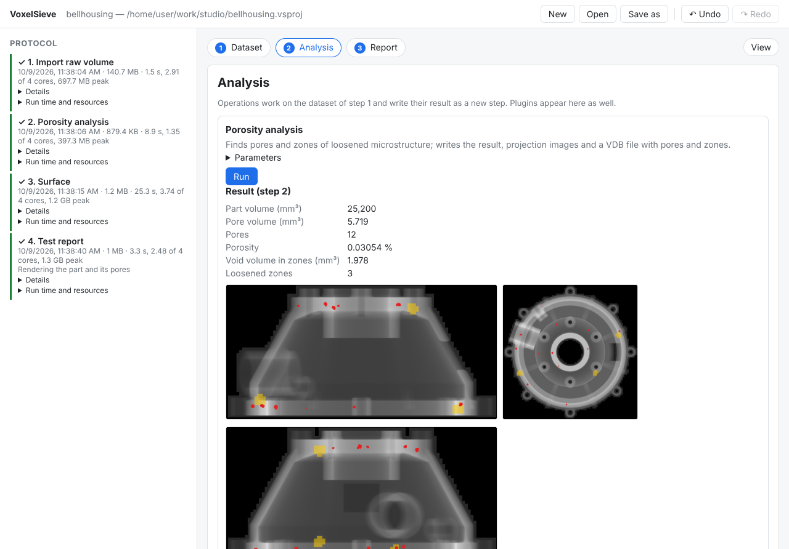

The view ("Ansicht") shows slices along x, y or z. It loads only the tiles on screen, from the
resolution level that matches the zoom, so it stays fast on scans of hundreds of GB. Wheel zooms,
dragging pans, the arrow keys (or Shift and the wheel) step through slices; pores are tinted red
and loosened zones yellow, and a click on a pore in the list jumps to it.

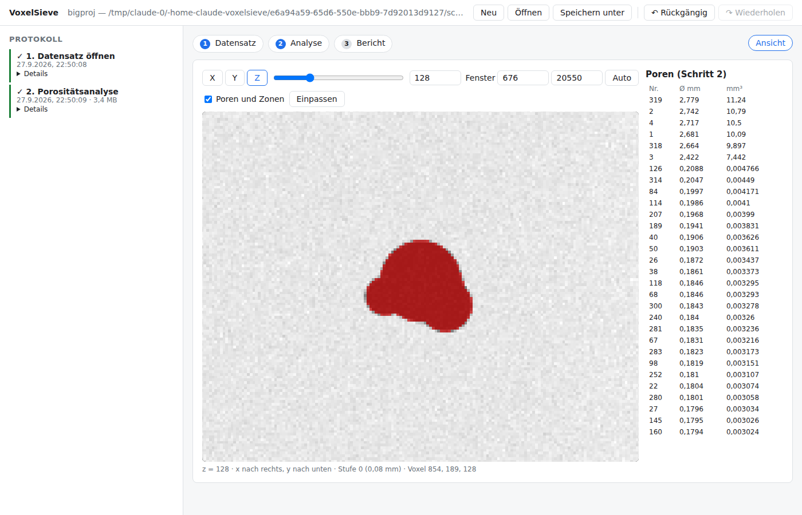

The 3D view ray-casts a coarse level of the dataset (at most 256 voxels per axis) in the browser:
"Oberfläche" shades the part surface at a threshold dragged in the histogram, "Transferfunktion"
composites colour and opacity per grey value, and "Maximumprojektion" shows the densest value
along each ray. The transfer function is edited on the histogram: click adds a control point,
drag moves it, double click removes it; each point has its own colour, colour maps (Stahl,
Viridis, Glut, Kupfer, Grau) recolour all points, and presets start from typical settings. Pores
and zones have their own colours, lighting follows the grey gradient, and a cut along x opens the
part. The background can be a studio light, a gradient or a plain colour.

"Extrahierte Oberfläche" shows only the surface from a run of the operation "Oberfläche", as a
triangle mesh at full resolution rather than the coarse level. Flat regions get larger triangles,
and a surface that would exceed the triangle budget (`GET /api/surface?max_triangles=`, default
1.5 million) is resampled at twice the voxel size until it fits. The cut along x opens it too.

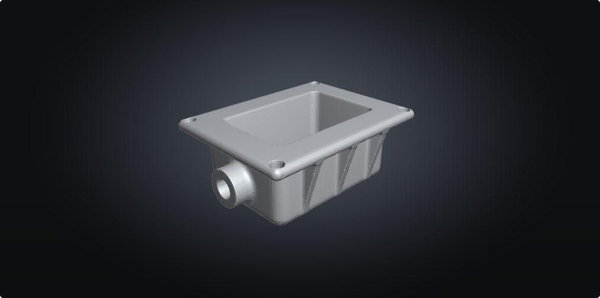

When a volume is loaded, the view suggests two or three renderings from its histogram, each with a
small picture: the density spread of the material, densities below the material (pores,
loosened structure) and further peaks such as inclusions, or else the part as a solid body.

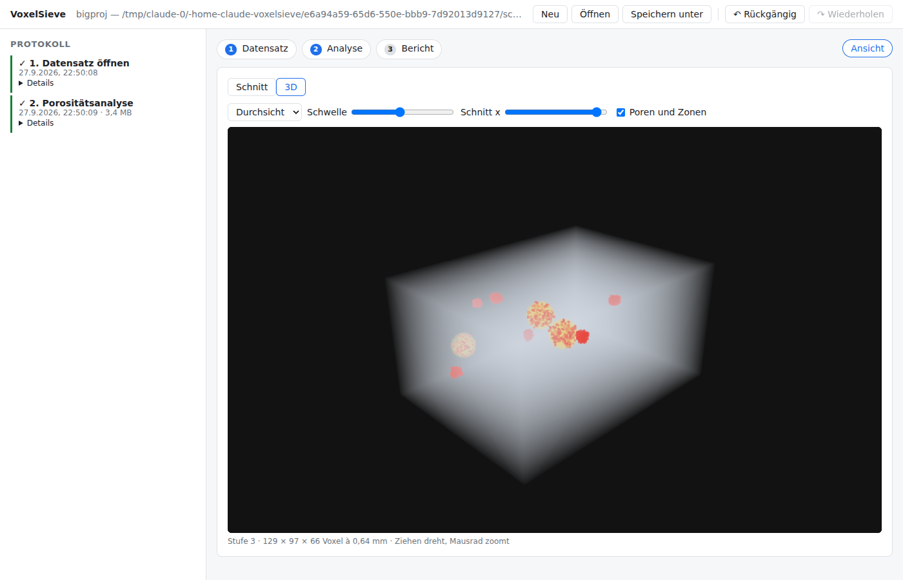

The project remembers how it was shown: stage, slice, zoom and window, camera, transfer function,
colours and background come back when it is opened again. "Ansicht speichern" keeps the current
view under a name with a picture in the project (`views/<id>.png`); a click on it shows it again,
and "Bild exportieren" downloads the picture. Views are presentation, not processing, so they are
not steps and undo leaves them alone.

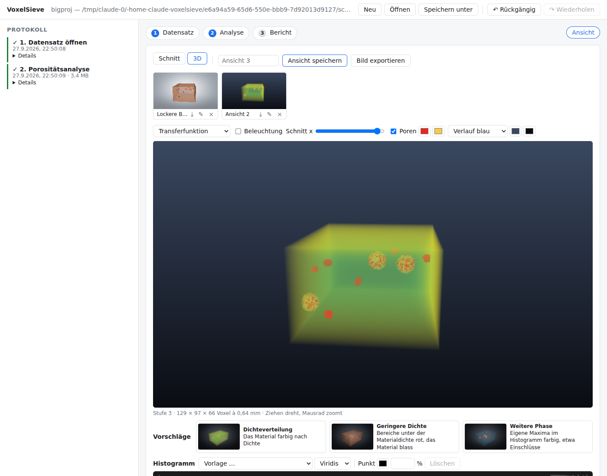

```sh
vs-studio --project /data/casting.vsproj --plugins build/release/plugins
```

The server listens on 127.0.0.1 only and has no authentication; do not expose it to a network.

## AI systems: MCP

`vs-studio --mcp` serves the studio over the Model Context Protocol (stdio), so an AI assistant can
drive VoxelSieve: create or open a project, run operations, undo and redo, and read results.
Register it with an MCP client as a stdio server, for example:

```json
{"mcpServers": {"voxelsieve": {"command": "vs-studio",
                               "args": ["--mcp", "--project", "/data/casting.vsproj"]}}}
```

Tools: `project_create`, `project_open`, `project_status`, `project_save_as`, `undo`, `redo`,
`list_operations`, `dataset_info`, `view_slice` (a slice as an image, with pores and zones),
`view_list` and `view_image` (saved views and their pictures), `view_save`, `view_set`,
`view_rename`, `view_delete`, `list_files`, `read_file`, `browse` and one `run_<operation>` per
operation, including plugins (`--plugins <dir>` or `VOXELSIEVE_PLUGIN_PATH`). Parameter schemas
come from the operations, errors come back as tool errors with the reason, and long operations
report progress. Datasets are never sent over the protocol, only their metadata and small text
results such as `porosity.json` or `report.json`.

## License

Apache-2.0, see [LICENSE](LICENSE).
